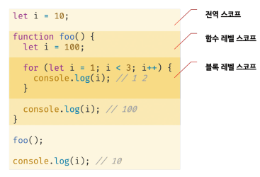
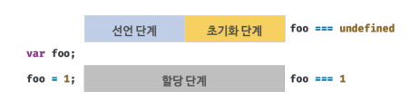
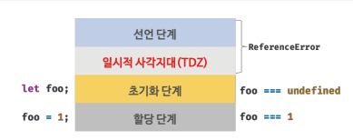

# 15장 let, const 키워드와 블록 레벨 스코프

### 15.1 var 키워드로 선언한 변수의 문제점

ES5까지 변수를 선언할 수 이"는 유일한 방법은 var 키워드를 사용하는 것이었다. 키워드로 선언된 변수는 아래의 특징이 있고 주의를 기울이지 않으면 문제를 발생시킬 수 있다.

#### 15.1.1 변수 중복 선언 허용

var 키워드로 선언한 변수는 중복 선언이 가능하다. 

```js
var x = 1;
var y = 1;

// var 키워드로 선언된 변수는 같은 스코프 내에서 중복 선언을 허용한다.

var x = 100;// 초기화 문이 있는 변수 선언문은 자바스크립트 엔진에 의해 var 키워드가 없는 것처럼 동작한다.
var y;// 초기화 문이 없는 변수 선언문은 무시된다.

console.log(x); // 100
console.log(y); // 1
```

 var 변수들은 중복 선언되었다. 이처럼 var 키워드로 선언한 변수를 중복선언하면 초기화문의 유무에 따라 다르게 동작한다. 초기화 문이 있는 변수 선언문은 자바스크립트 엔진에 의해 var 키워드가 없는 것처럼 동작하고 초기화 문이 없는 변수 선언문은 무시된다. 이때 에러는 발생하지 않는다.

위 예제와 같이 만약 동일한 이름의 변수가 이미 선언되어있는 것을 모르고 변수를 중복 선언하면서 값까지 할당했다면 의도치 않게 먼저 선언된 변수 값이 변경되는 부작용이 발생한다.

#### 15.1.2 함수 레벨 스코프

var 키워드로 선언한 변수는 오로지 함수의 코드 블록만을 지역 스코프로 인정한다. 따라서 함수 외부에서 var 키워드로 선언한 변수는 코드 블록 내에서 선언해도 모두 전역변수가 된다.

```js
var x = 1;
if(true) {
    var x = 10; // x 는 전역변수다. 이미 선언된 전역 변수 x가 있으므로 x변수는 중복 선언된다.
    // 이는 의도치 않게 변수의 값이 변경되는 부작용을 발생시킨다.
}
console.log(x); // 10
```

for문의 변수 선언문에서 var 키워드로 선언한 변수도 전역변수가 된다.

```js
var i = 10;

for (var i = 0; i < 5; i++) {// for 문 내의 var i = 0 또한 전역변수 이미 선언된 전역 변수가 있으므로 중복 선언
    console.log(i);// 0 1 2 3 4
}
console.log(i); // 5
```

함수 레벨 스코프는 전역 변수를 남발할 가능성을 높인다. 이로 인해 의도치 않게 전역 변수가 중복 선언되는 경우가 발생한다.

#### 15.1.3 변수 호이스팅

var 키워드로 변수를 선언하면 변수 호이스팅에 의해 변수 선언문이 스코프의 선두로 끌어올려진 것처럼 동작한다. 즉, 변수 호이스팅에 의해 var 키워드로 선언한 변수는 변수 선언문 이전에 참조할 수 있다. 단, 할당문 이전에 변수를 참조하면 언제나 undefined를 반환한다.

``` js
// 변수 호이스팅에 의해 foo변수가 선언됨(선언 단계)
console.log(foo);// undefined 변수 foo가 undefined로 초기화 된다.(초기화 단계)
foo = 123;// 변수에 값을 할당(할당 단계)
console.log(foo);// 123
var foo;// 변수 선언은 런타임 이전에 js에 의해 암묵적으로 실행된다.
```

변수 선언문 이전에 변수를 참조하는 것은 변수 호이스팅에 의해 에러를 발생시키지 않지만 프로그램의 흐름상 맞지 않을 뿐더러 가독성을 떨어뜨리고 오류를 발생시킬 여지를 남긴다.

### 15.2 let 키워드

앞서 살펴본 var키워드의 단점을 보완하기 위해 es6에서는 새로운 변수 선언 키워드인 let과 const를 도입했다.


#### 15.2.1 변수 중복 선언 금지

var 키워드로 이름이 동일한 변수를 중복 선언하면 아무런 에러가 발생하지 않는다. 이때 변수를 중복 선언하면서 값까지 할당했다면 의도치 않게 먼저 선언된 변수 값이 재할당되어 변경되는 부작용이 발생한다.

하지만 let 키워드로 이름이 같은 변수를 중복 선언하면 문법 에러가 발생한다.

```js
var foo = 123;// var 키워드로 선언된 변수는 같은 스코프 내에서 중복 선언 허용, 아래 변수 선언문은 js엔진에 의해 var 키워드가 없는 것처럼 행동한다.

var foo = 456;

let bar = 123;// let이나 const 키워드로 선언된 변수는 같은 스코프 내에서 중복 선언을 허용하지 않는다.

let bar = 456; // Uncaught SyntaxError: Identifier 'bar' has already been declared
```

#### 15.2.2 블록 레벨 스코프

var 키워드로 선언한 변수는 오로지 함수의 코드 블록만을 지역 스코프로 인정하는 함수 레벨 스코프를 따른다. 하지만 let 키워드로 선언한 변수는 모든 코드 블록(함수, if 문, for문, while 문, try/catch 문 등)을 지역 스코프로 인정하는 블록 레벨 스코프를 따른다. 

```js
let foo = 1;// 전역변수
{
    let foo = 2;
    let bar = 3;// 지역변수
}
console.log(foo);// 1
console.log(bar); // ReferenceError: bar is not defined
```

let 키워드로 선언된 변수는 블록 레벨 스코프를 따른다. 고로 전역에서 선언된 foo 변수와 코드 블록 내에서 선언된 foo 변수는 별개의 변수다. 따라서 전역에서는 bar 변수를 참조할 수 없다.

함수도 코드 블록이므로 스코프를 만든다.



#### 15.2.3 변수 호이스팅

var 키워드로 선언한 변수와 달리 let 키워드로 선언한 변수는 변수 호이스팅이 발생하지 않는 것처럼 동작한다. 

```js
console.log(foo);//ReferenceError: foo is not defined
let foo;
```

이처럼 let 키워드로 선언한 변수를 변수 선언문 이전에 참조하면 참조에러가 발생한다.

var 키워드로 선언한 변수는 런타임 이전에 js 엔진에 의해 암묵적을로 선언단계와 초기화 단계가 진행된다.

즉, 선언 단계에서 스코프(실행 컨텍스트의 렉시컬 환경)에 변수 식별자를 등록해 js엔진에 변수의 존재를 알린다. 그리고 즉시 초기화 단계에서 undefined로 변수를 초기화 한다. 따라서 변수 선언문 이전에 변수에 접근해도 스코프에 변수가 존재하기 때문에 에러가 발생하지 않는다. 다만 undefined를 반환한다. 이후 변수 할당문에 도달하면 비로소 값이 할당된다.

```js
console.log(foo);// 런타임 이전에 선언 단계와 초기화 단계 실행, 변수 선언문 이전에 변수 참조 가능 undefined 출력

var foo;

console.log(foo);// undefined

foo = 1;//할당문에서 할당 단계의 실행

console.log(foo);// 1
```



let키워드로 선언한 변수는 선언단계와 초기화 단계가 분리되어 진행

즉, 런타임 이전에 암묵적으로 선언단계가 먼저 실행되나 초기화 단계는 변수 선언문에 도달했을 때 실행된다.

만약 초기화 단계가 실행되기 이전에 변수에 접근하려 하면 참조 에러가 발생한다. let 키워드 선언 변수는 스코프 시작지점부터 초기화 단계 시작지점(선언문) 까지 변수를 참조할 수 없다. 이 구간을 일시적 사각지대라고 한다.

```js
console.log(foo); // ReferenceError

let foo;// 초기화 단계 실행
console.log(foo);

foo = 1;// 할당문에서 할당 단계 실행
console.log(foo);
```



결국 let키워드로 선언한 변수는 변수 호이스팅이 발생하지 않는것처럼 보인다. 하지만 그렇지 않다.

```js
let foo = 1;//전역 변수
{
    console.log(foo);// ReferenceError: Cannot access 'foo' before initialization
    let foo = 2;// 지역 변수
}
```

```js
let foo = 1;//전역 변수
{
    console.log(foo);// 1
}
```


let 키워드로 선언한 변수의 경우 변수 호이스팅이 발생하지 않는다면 위 예제는 전역변수 foo의 값을 출력해야 한다. 하지만 let 키워드로 선언한 변수도 여전히 호이스팅이 발생하기 때문에 참조에러가 발생했다.

js는ES6에서 도입된 let, const를 포함해서 모든 선언(var, let, const, function, function*, class 등)을 호이스팅한다. 단, ES6에서 도입된 let, const, class 를 사용한 선언문은 호이스팅이 발생하지 않는 것처럼 동작한다.

#### 15.2.4 전역 객체와 let

var 키워드로 선언한 전역 벼니수와 전역함수, 그리고 선언하지 않은 변수에 값을 할당한 암묵적 전역은 전역객체 window의 프로퍼티가 된다. 전역 객쳉의 프로퍼티를 참조할 때 window를 생략할 수 있다.

```js
var x = 1;
y = 2; // 암묵적 전역
function foo() {}
console.log(window.x); // 1
console.log(x); // 1
console.log(window.y); // 2
console.log(y); // 2
console.log(window.foo); // foo() {}
console.log(foo); // foo() {}
```

let 키워드로 선언한 전역 변수는 전역 객체의 프로퍼티가 아니다. 즉, window.foo와 같이 접근할 수 없다.

let 전역변수는 보이지 않는 개념적인 블록(전역 렉시컬 환경의 선언적 환경레코드, 이에 대해서는 실행 컨텍스트에서 자세히 살펴본다.)내에 존재하게 된다.

```js
let x = 1;
console.log(window.x);// undefined (let. const 키워드로 선언한 전역 변수는 전ㅌ역 객체 window의 프로퍼티가 아니다.)
console.log(x);// 1
```

### 15.3 const 키워드

const키워드는 상수를 선언하기 위해 사용한다. 하지만 반드시 상수만을 위해 사용하지는 않는다. 

#### 15.3.1 선언과 초기화

const 키워드로 선언한 변수는 반드시 선언과 동시에 초기화 해야한다.

```js
const foo = 1;
```

```js
const foo;// Uncaught SyntaxError: Missing initializer in const declaration
```

let 키워드와 마찬가지로 블록레벨 스코프를 가지고 변수 호이스팅이 일어나지 않는 것처럼 동작한다.

```js
{
    console.log(foo); // ReferenceError: Cannot access 'foo' before initialization
    const foo = 1;
    console.log(foo);// 1
}
console.log(foo);// ReferenceError: foo is not defined
```

#### 15.3.2 재할당 금지

var 또는 let 키워드로 선언한 변수는 재할당이 자유로우나 const 키워드로 선언한 변수는 재할당이 금지된다.

```js
const foo = 1;
foo = 2; // TypeError: Assignment to constant variable.
```

#### 15.3.3 상수

const 키워드로 선언한 변수에 원시값을 할당한 경우 변수값을 변경할 수 없다. 원시값은 변경 불가능한 값으로 재할당 없이 값을 변경할 방법이 없기 때문이다.

변수의 상대 개념인 상수는 재할당이 금지된 변수를 말한다. 상수도 값을 저장하기 위한 메모리 공간이 필요하므로 변수라고 할 수 있다. 단, 변수는 언제든지 재할당을 통해 변수 값을 변경할 수 있지만 상수는 재할당이 금지된다. 상수는 상태유지와 가독성 유지보수의 편의를 위해 적극적으로 사용해야한다.

```js
let preTaxPrice = 100;
let afterTaxPrice = preTaxPrice + (preTaxPrice * 0.1);

console.log(afterTaxPrice); // 110
```

코드 내에서 사용한 0.1은 어떤 의미로 사용했는지 명확히 알기 어렵기 때문에 가독성이 좋지 않다. 또한 세율을 의미하는 0.1은 쉽게 바뀌지 않는 값이며 프로그램  전체에서 고정된 값을 사용해야 한다. 이때 세율을 상수로 정의하면 값의 의미를 쉽게 파악할 수 있고 변경될 수 없는 고정값으로 사용할 수 있다.

const 키워드로 선언된 변수는 재할당이 금지된다. const 키워드로 선언된 변수에 원시 값을 할당한 경우 원시 값은 변경할 수 없(immutable)는 값이고 const 키워드에 의해 재할당이 금지되므로 할당된 값을 변경할 수 있는 방법은 없다. 또한 상수는 프로그램 전체에서 공통적으로 사용하므로 나중에 세율이 변경되면 상수만 변경하면 되기 때문에 유지 보수성이 대폭 향상된다.


일반적으로 상수의 이름은 대문자로 선언해 상수임을 명확히 나타낸다. 여러 단어로 이뤄진 경우에는 언더스코어(_)로 구분해서 스네이크 케이스로 표현하는 것이 일반적이다.

```js
const TAX_RATE = 0.1;
let preTaxPrice = 100;
let afterTaxPrice = preTaxPrice + (preTaxPrice * TAX_RATE);

console.log(afterTaxPrice); // 110
```

#### 15.3.4 const 키워드와 객체

const 키워드로 선언된 변수에 원시 값을 할당한 경우 값을 변경할 수 없다. 하지만 const 키워드로 선언된 변수에 객체를 할당한 경우 값을 변경할 수 있다.

변경 불가능한 값인 원시 값은 재할당 없이 변경(교체)할 수 있는 방법이 없지만 변경 가능한 값인 객체는 재할당 없이도 직접 변경이 가능하기 때문이다.

```js
const person = {
    name: 'Lee'
};

person.name = 'Kim';// 객체는 변경 가능한 값이다. 따라서 재할당 없이 변경이 가능하다.
console.log(person); // {name: 'Kim'}
```

11.1.1절에서 '변경 불가능한 값'에서 살펴본 바와 같이 const 키워드는 재할당을 금지할 뿐 "불변"을 의미하지는 않는다.

새로운 값을 재할당 하는 것은 불가능하지만 프로퍼티 동적 생성, 삭제, 프로퍼티 값의 변경을 통해 객체를 변경하는 것은 가능하다. 이때 객체가 변경되더라도 변수에 할당된 참조 값은 변경되지 않는다.

### 15.4 var vs let vs const

변수 선언에는 기본적으로 const를 사용하고 elt은 재할당이 필요한 경우에 한정해 사용하는 것이 좋다.

const키워드를 사용하면 의도치 않은 재할당을 방지하기 때문에 좀더 안전하다.

var let const 키워드는 다음과 같이 사용하는 것을 권장한다

- ES6를 사용한다면 var 키워드를 사용하지 않는다.
- 재할당이 필요한 경우에 한정해 let 키워드를 사용한다. 이때 변수의 스코프는 최대한 좁게 만든다.
- 변경이 발생하지 않고 읽기 전용으로 사용하는(재할당이 필요없는 상수) 원시 값과 객체에는 const 키워드를 사용한다. const 키워드는 재할당을 금지하므로 var, let 보다 안전하다.

변수를 선언하는 시점에는 재할당이 필요할 지 잘 모르는 경우가 많다. 그리고 객체는 의외로 재할당 하는 경우가 드물다. 

따라서 변수를 선언할 때는 일단 const를 사용하자. 반드시 재할당이 필요하다면 그때 let으로 변경해도 늦지 않다.