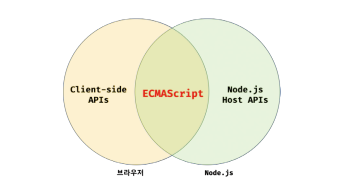
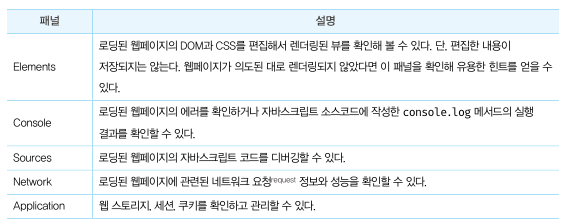
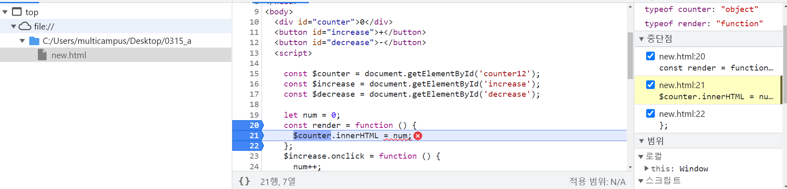
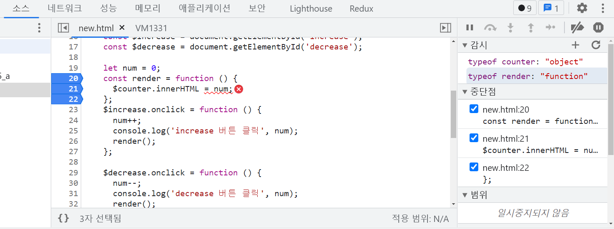
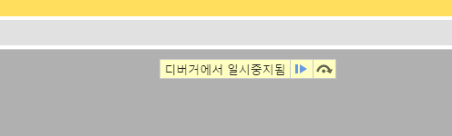
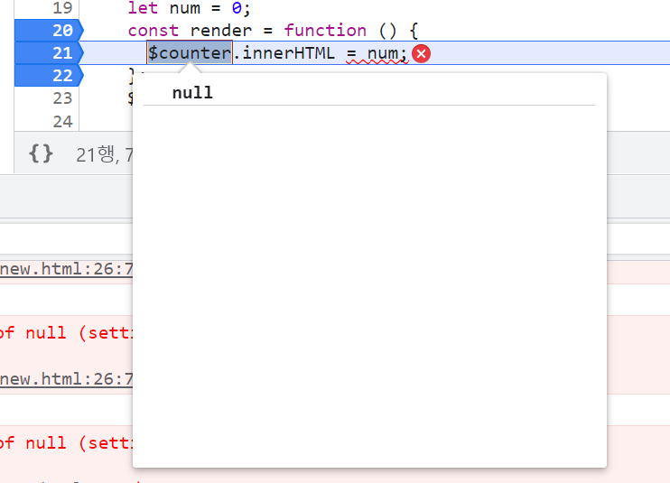
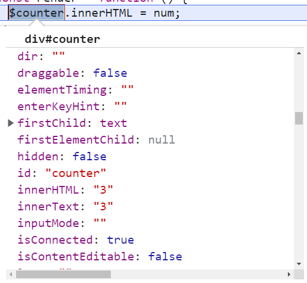
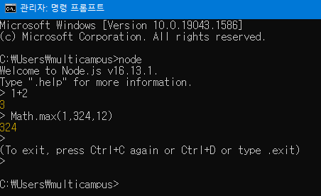

# 3장 자바스크립트 개발 환경과 실행 방법

### 3.1 실행환경

모든 브라우저가 js를 해석하고 실행할 수 있는 엔진을 내장한다.

node.js또한 js 엔진을 내장한다.

js는 브라우저 혹은 node.js 환경에서 실행할 수 있다.

#### 브라우저와 node.js 의 차이

- 브라우저는 html, css, js 를 실행해 웹페이지를 브라우저 화면에 렌더링하는것이 주 목적

- node.js는 브라우저 외부에서 js 실행 환경을 제공하는 것이 주 목적

- 브라우저는 파싱된 html요소를 선택하거나 조작하는 기능의 집합 DOM API를 기본적으로 제공

- 브라우저 외부에서 JS 개발환경을 제공하는 NODE.JS는 DOM API를 제공하지 않음
- NODE.JS는 파일 생성, 수정하는 시스템을 기본 제공(브라우저는 지원하지 않음)
- 웹 어플리케이션의 자바스크립트는 사용자 컴퓨터의 브라우저에서 동작한다.
- 만약 브라우저를 통해 다운로드가 되어 실행되는 자바스크립트가 사용자 컴퓨터의 로컬 파일을 삭제 수정 생성할 수 있다면 컴퓨터가 악성 코드에 그대로 노출된 것과 마찬가지다.
- 보안상의 이유로 브라우저 환경의 JS는 파일 시스템을 제공하지 않는다.



### 3.2 웹 브라우저

크롬을 사용함

#### 3.2.1 개발자 도구 

단축키 F12 or Ctrl + Shift + I



#### 3.2.2 콘솔

- 에러가 발생한 경우
- 구현시 디버깅 실행보다 간편하게 코드 실행 결과를 확인 가능
- 꿀팁 개발자 도구 우측 점 세개 클릭하면 개발자 도구를 분리할 수 있다.(듀얼 트리플 모니터 쓰면서도 안써먹고 있던 내자신..)

#### 3.2.3 브라우저에서 JS 실행

브라우저는 HTML 파일을 로드하면 script 태그에 포함된 코들르 실행한다.

```javascript
<!DOCTYPE html>
<html lang="en">
<head>
  <meta charset="UTF-8">
  <meta http-equiv="X-UA-Compatible" content="IE=edge">
  <meta name="viewport" content="width=device-width, initial-scale=1.0">
  <title>counter</title>
</head>
<body>
  <div id="counter">0</div>
  <button id="increase">+</button>
  <button id="decrease">-</button>
  <script>

    const $counter = document.getElementById('counter-x');// 에러가 발생
    const $increase = document.getElementById('increase');
    const $decrease = document.getElementById('decrease');

    let num = 0;
    const render = function () {
      $counter.innerHTML = num;
    };
    $increase.onclick = function () {
      num++;
      console.log('increase 버튼 클릭', num);
      render();
    };

    $decrease.onclick = function () {
      num--;
      console.log('decrease 버튼 클릭', num);
      render();
    };
  </script>

  
</body>
</html>
```

#### 3.2.4 디버깅

에러 정보의 오른쪽에 에러 발생 위치를 클릭하면 js코드를 디버깅할수 있는 sources 패널로 이동함.

https://developer.chrome.com/docs/devtools/javascript/?hi=ko

구글의 콘솔과 디버깅에 대한 내용

파일 탐색기 창(좌) / 코드 편집기 창(중간) / javascript 디버깅 창(우)






실행중간에 멈추게 하고싶은 부분의 코드 줄 번호를 클릭하면 중단점이 생성된다.

 중단점을 사용하면 실행 도중에 코드를 일시 중지하고 해당 시점의 모든 값을 검사할 수 있다(console.log 명령어 보다 더 빠른 디버깅을 도움)

- 중단점을 사용하면 코드가 어떻게 구성되어 있는지 모르는 상태에서 관련 코드에서 일시 중지할 수 있다.
- 중단점을 사용하여 DevTools는 해당 시점의 모든 변수 값을 표시



다음과 같이 중단점을 생성하고 스크립트를 실행 재개하자 브라우저에 뜬 중지 모습



소스창에서 중단점에 있는 counter 를 마우스오버 해보니 원래대로라면 object 값이어야 하는데 null이라 생긴 오류 그래서 코드를 고쳐 주니 아래와 같이 counter 값이 object 형태로 값들도 잘 들어간 모습을 볼 수 있었다.




```javascript
<!DOCTYPE html>
<html lang="en">
<head>
  <meta charset="UTF-8">
  <meta http-equiv="X-UA-Compatible" content="IE=edge">
  <meta name="viewport" content="width=device-width, initial-scale=1.0">
  <title>counter</title>
</head>
<body>
  <div id="counter">0</div>
  <button id="increase">+</button>
  <button id="decrease">-</button>
  <script>

    const $counter = document.getElementById('counter');
    const $increase = document.getElementById('increase');
    const $decrease = document.getElementById('decrease');

    let num = 0;
    const render = function () {
      $counter.innerHTML = num;
    };
    $increase.onclick = function () {
      num++;
      console.log('increase 버튼 클릭', num);
      render();
    };

    $decrease.onclick = function () {
      num--;
      console.log('decrease 버튼 클릭', num);
      render();
    };
  </script>

  
</body>
</html>
```

바뀐 코드의 모습~!!!!

#### 3.3.3 REPL

명령 프롬프트에서 node의 REPL 사용해보기(자바 스크립트 코드를 실행해 결과 확인 가능)



Ctrl + C 두번으로 나옴

 ### 3.4 VSCODE

좀 꿀인것 같아서 확장 플러그인 LIVE SERVER 를 써봄

 GO LIVE 를 클릭하면 가상 서버가 기동되어 브라우저에 HTML 파일이 자동 로딩이 된다.소스 코드 수정 사항도 가상 서버에 자동으로 반영된다고 함.