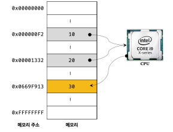
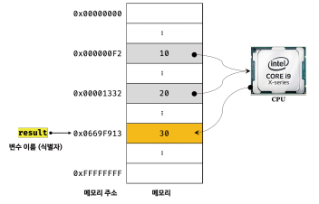
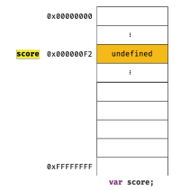
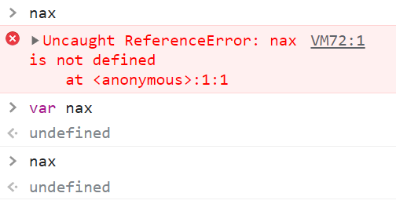
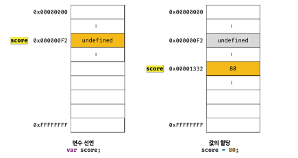
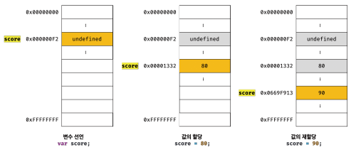
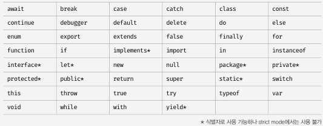

# 4장 변수

### 4.1 변수란 무엇인가? 왜 필요한가?

애플리케이션은 데이터를 다룬다.

데이터를 입력받아 처리하고 결과를 출력하는 것이 애플리케이션의 전부

변수 : 프로그래밍 언어에서 데이터를 관리하기 위한 핵심 개념.

```
10 + 20
```

평가 : JS 엔진이 코드를 계산한다.

10, 20, + : 기호(리터럴과 연산자)

10 + 20 : 표현식

파싱 : 표현식 의미의 해석

- 순서 : JS 엔진이 식의 의미를 해석 +연산을 수행하기 위해 먼저 + 연산자의 좌, 우변의 숫자값 피연산자를 기억한다.
- 컴퓨터는 CPU를 사용해 연산하고 메모리를 사용해 데이터를 기억한다.
  - 메모리는 데이터를 저장할 수 있는 메모리 셀의 집합체다
  - 메모리셀 1개의 크기는 1바이트(8비트)이며, 컴퓨터는 메모리 셀의 크기, 즉 1바이트 단위로 데이터를 저장하고 읽어들인다.


- 각 셀은 고유의 메모리 주소를 갖는다.
  - 이 메모리 주소는 메모리 공간의 위치를 나타내며 0 부터 메모리 크기만큼 정수로 표현된다..
  - 4GB 예시 0~4,294,967,295(0x00000000 ~ 0xFFFFFFFF)까지의 메모리 주소를 갖는다.
  - 메모리에 저장되는 데이터는 종류상관 없이 모두 2진수로 저장된다.



- 다음과 같이 연산이 성공적으로 끝나고 결과 또한 메모리에 저장 되었지만 30이란 숫자를 재사용할 수 없다.
  - 0x0669F913 의 메모리 주소를 통해 연산 결과 값이 저장된 메모리 공간에 직접 접근하는 방법밖에 없다.
  - 메모리 주소를 통해 직접 값에 접근하면 치명적 오류를 발생시킬 가능성이 매우 높다. -> 운영체제가 사용하는 값을 변경하면 시스템을 멈추게 하는 오류 발생 가능

결론 : JS는 개발자의 직접적 메모리 제어를 허용하지 않는다.

- 하지만 JS 가 개발자의 직접적 메모리 제어를 허용한다면 발생하는 문제점!!
  - 값이 저장될 메모리 주소는 코드가 실행 될 때 메모리의 상황에 따라 임의로 결정됨. 
  - -> 동일한 컴퓨터에 동일한 코드를 실행해도 값이 저장될 메모리 주소는 변경됨.
  - 코드 실행 이전에 값이 저장될 메모리 주소를 알수 없고 알려주지도 않는다.

-> 메모리 주소를 통해 값에 직접 접근하는 시도는 올바르지 않는 방법

변수란 : 하나의 값을 저장하기 위해 확보한 메모리 공간 자체 또는 그 메모리 공간을 식별하기 위해 붙인 이름을 말함

간단히 값의 위치를 가리키는 상징적 이름

개발자가 직접 메모리 주소를 통해 값을 저장하고 참조할 필요없이 변수를 통해 안전하게 값에 접근할 수 있다.


변수에 여러 값을 저장하는 방법

-> 배열 혹은 객체의 자료 구조를 사용하면 관련있는 여러개의 값을 그룹화 해서 하나의 값처럼 사용 가능하다.

```javascript
var userId = 1;
var userName = 'Lee';
var user = {id: 1, name: 'Lee'};
var users = [
	{id: 1, name: 'Lee'},
	{id: 2, name: 'Park'}
];
```



```javascript
var result = 10 + 20;
```


>변수 : 연산을 통해 생성된 값 30 을 메모리 공간에 저장하고 이때의 저장된 값 30을 재사용 가능하도록 상징적 이름을 붙인다
>
>변수의 이름 : result ( 사람을 위해 사람이 이해할 수 있는 언어로 값이 저장된 메모리 공간에 붙인 상징적인 이름)
>
>변수의 값 : 30
>
>할당 : 변수에 값을 저장하는 것
>
>참조 : 변수에 저장된 값을 읽어 들이는 것 ( 변수 이름을 사용해 참조 요청시 js 엔진은 변수 이름과 매핑된 메모리 주소를 통해 메모리 공간에 접근해서 저장된 값을 반환함 )

변수에 저장된 값의 의미를 파악할 수 있는 변수 이름은 가독성을 높이는 부수적인 효과가 있음.

변수의 이름은 첫 아이의 이름을 짓듯이 심사숙고해서 잘 지어야 한다.

### 4.2 식별자

변수 이름을 식별자라고도 한다. 어떤 값을 구별해서 식별할 수 잇는 고유한 이름을 말함.

##### 식별자는 값이 아닌 메모리 주소를 기억하고 있음.

다음의 그림을 보면 식별자가 기억하고 있는 메모리 주소를 통해 메모리 공간에 저장된 값에 접근할 수 있다. (식별자는 메모리 주소에 붙인 이름)


식별자는 변수, 함수, 클래스 등의 이름이 될 수 있다.

변수 이름으로는 메모리 상에 존재하는 변수 값을 식별 가능하고 함수 이름으로는 메모리 상에 존재하는 함수를 식별 가능함

즉, 메모리 상에 존재하는 어떤 값을 식별할 수 있는 이름은 모두 식별자라고 함.

선언을 통해 JS 엔진에 식별자의 존재를 알림

### 4.3 변수 선언

선언 : 변수 생성을 의미한다.

1. 값을 저장하기 위한 메모리 공간 확보
2. 변수 이름과 확보된 메모리 공간의 주소 연결
3. 저장할 수 있도록 준비

선언에 의해 확보된 공간은 해제 되기 전까지 보호되므로 안전하게 사용 가능함

선언 키워드 : const, let, var(여러 단점 존재 -> const, let 이 단점을 보완하기 위해 도입됨, scope 와 관련된 js 핵심 개념을 먼저 살펴보고 단점에 대해 논의하도록해요)

```javascript
var score;
```

score 의 이름으로 변수를 선언할 것을 지시하는 var 키워드

다음과 같이 변수 이름을 등록하고 저장할 메모리 공간을 확보함



변수 선언 이후 변수에 값을 할당하지 않은 상태 -> 비어있을것 같지만 js 엔진에 의해 undefined라는 값이 암묵적으로 초기 할당되어있음.

undefined 는 원시타입의 값이다. -> 6장에서 자세히 살펴보자

var 키워드를 사용한 변수 선언은 선언 단계와 초기화 단계가 동시에 진행된다.

변수 이름 score 등록, score 변수에 암묵적으로 undefined 할당

따라서 var 키워드로 선언한 변수는 할당 없이도 undefined라는 값을 갖는다.

```
문제 발생 
Error with Permissions-Policy header: Unrecognized feature: 'interest-cohort'.
```


- 초기화 단계를 거치지 않으면 확보된 메모리 공간에 다른 어플리케이션이 사용했던 값이 남아있을 수 있는데 이런 값을 쓰레기 값이라고 한다.
- js 의 var 키워드는 암묵적으로 초기화를 수행하므로 할당 없이 변수값 참조할 때 쓰레기 값이 나오는 위험으로부터 안전함

- 선언 없이 식별자에 접근하면 참조 에러가 발생한다.



### 4.4 변수 선언의 실행 시점과 변수 호이스팅

```javascript
console.log(score);
var score;
```

선언보다 참조가 우선되는 다음의 코드를 보면 참조에러가 뜰것같지만 undefined 가 출력된다.

그 이유는 변수 선언이 소스코드가 한줄씩 순차적로 실행되는 시점, 런타임이 아니라 그 이전 단계에서 먼저 실행되기 때문이다.

소스 코드의 평가 과정을 거쳐 선언문을 찾아내 먼저 실행하고 그 이후 한줄 씩 순차적으로 실행한다.

한마디로 우선순위로 따지면 var > console.log 인것이다.

-> js 엔진은 변수 선언이 소스코드 어디든 상관없이 다른  코드보다 먼저 실행한다. 

변수 호이스팅 : 변수 선언문이 코드의 선두로 끌어올려진 것처럼 동작하는 js 고유의 특징

### 4.5 값의 할당

변수에 값을 할당시 연산자 '=' 를 사용한다. 우변의 값을 좌변에 할당함.

```javascript
var score;
score = 80;
```

```javascript
var score = 80;
```

정확하게 같은 코드

주의할 점은 변수 선언과 값의 할당의 실행 시점이 다르다.

```javascript
console.log(score);//2

var score;//1
score = 80;//3

console.log(score);//4
```



런타임 이전 : 변수 선언

런타임 이후 : 값의 할당

```javascript
console.log(score);//2

score = 80;//3
var score;//1

console.log(score);//4
```

위치가 어디든 상관 없다~!!

### 4.6 값의 재할당

재할당 : 이미 값이 할당되어있는 변수에 새로운 값을 할당하는 것

```javascript
var score = 80;
score = 90;
```

var은 재할당이 가능하다.

최초 값도 undefined 인데 그 값을 재할당하는 것

상수는 재할당 불가한 단 한번만 할당할 수 있는 변수(const로 상수를 표현 가능 -> 반드시 상수만을 위해 사용되지는 않음 15장으로~)



가비지 콜렉터에 의해 메모리에서 자동 해제되는 undefined, 80

js 는 가비지 콜렉터를 내장하고 있는 매니지드 언어로 이를 통해 메모리 누수를 방지한다.

언매니지드 언어 : C 개발자가 명시적으로 메모리를 할당하고 해제해서 최적의 성능을 확보 가능하지만 할당 해제 잘못하면 최악의 상황,,,

매니지드 언어 : JS 개발자의 역량에 의존하는 부분이 상대적으로 작아져 어느정도 일정한 생산성을 확보할 수 있으나 성능면에서 손실을 감수할 수 밖에..

### 4.7 식별자 네이밍 규칙

- 특수문자를 제외한 숫자, 언더스코어(_), 달러기호($)를 포함할 수 있다.
- 특수문자를 제외한 문자, 언더스코어(_), 달러기호($)로 시작해야한다. 
- 숫자로 시작할 수 없다.
- 예약어(프로그래밍 언어에서 사용되거나 될 예정인 단어)는 식별자로 사용할 수 없다.
-  

변수 이름도 식별자이므로 위의 네이밍 규칙을 따라야 한다.

가능한 경우 예시:

```javascript
var person, $elem, _name, first_name, val1;
```

가독성이 떨어지므로 , 로 여러개 만드는 것 비추함

ES5 부터 식별자 생성시 유니코드 문자 허용하나 알파벳 외의 문자로 명명된 식별자는 바람직하지 않으므로 권장하지 않음.

불가한 경우 예시:

```javascript
var first-name;
var 1st;
var this;
```

js 는 대소문자를 구별하므로 다음의 변수는 별개

```javascript
var firstname;
var firstName;
var FIRSTNAME;
```

변수 이름은 변수의 존재 목적을 쉽게 이해할 수 있도록 명확히 표현해야한다.

```javascript
var x = 3;// 
var score = 100;
```

변수 소개에 주석달면 하수~

네이밍 컨벤션 : 하나 이상의 영단어 구성된 식별자 생성시 가독성 좋게 한눈에 구분하기 위한 명명규칙

카멜케이스

```
var firstName;
```

스네이크케이스

```
var first_name;
```

파스칼 케이스

```
var FirstName;
```

헝가리언 케이스

```
var strFirstName;//type + identifier
var $elem = document.getElementById('myId'); //DOM 노드
```

일반적으로 변수 함수의 이름은 카멜케이스 사용

생성자함수, 클래스 이름에는 파스칼 케이스 사용