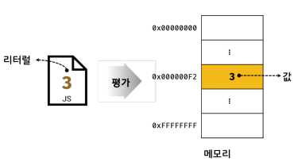
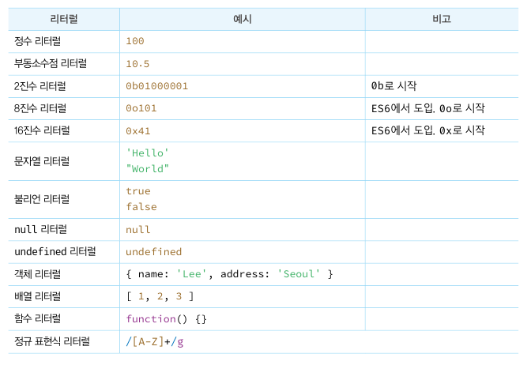

# 5장 표현식과 문

### 5.1 값

#### 표현식이 평가되어 생성된 결과를 말한다.

다음 예제의 식은 평가되어 숫자 값 30을 생성한다.

```
10 + 20;
```

모든 값은 데이터 타입을 가지며, 메모리에 2진수 비트의 나열로 저장된다.

메모리 저장된 값 0100 0001을 숫자로 해석하면 65지만 문자는 'A'이다.

변수 : 하나의 값을 저장하기 위해 확보한 메모리 공간 자체 또는 메모리 공간을 식별하기 위해 붙인 이름

변수에 할당되는 것은 값이다.

```
var sum = 10 + 20;
```

sum 에 할당되는 것은 10 + 20 이 아니라 평가 결과인 숫자값 30 이다.

10 + 20 은 할당 이전에 평가되어 값을 생성해야 한다.


### 5.2 리터럴

사람이 이해할 수 있는 문자 또는 약속된 기호를 사용해 값을 생성하는 표기법

숫자 3은 단순한 아라비아 숫자가 아닌 숫자 리터럴이다.아라비아 숫자를 사용해 숫자 리터럴 3을 코드에 기술하면 js 엔진이 평가해 숫자값 3을 생성한다.



js엔진 코드가 실행되는 시점인 런타임에 리터럴을 평가해 값을 생성한다.

리터럴은 값을 생성하기 위해 미리 약속한 표기법이라 할 수 있다.



### 5.3 표현식

값으로 평가될 수 있는 문 : 표현식이 평가되면 새로운 값을 생성하거나 기존값을 참조한다.

리터럴 또한 표현식이다.

```
var score  = 100;
```

예제의 100이 리터럴이다. 결국 리터럴 100 은 자바스크립트 엔진에 의해 평가되어 값을 생성하므로 리터럴은 그 자체로 표현식이다.

```
var score = 50 + 50;
```

50 + 50 은 리터럴과 연산자로 이뤄져있다. 50 + 50 도 평가되어 숫자값 100을 생성하므로 표현식이다.

```
score;
```

변수 식별자를 참조하면 변수 값으로 평가된다. 식별자 참조는 값을 생성하지는 않지만 값으로 평가되므로 표현식이다.

표현식은 리터럴, 식별자(변수, 함수 등의 이름), 연산자, 함수 호출 등의 조합으로 이뤄질 수 있다.

표현식 : 값으로 평가될 수 있는 문

```
10
'Hello'// 리터럴 표현식

sum
person.name
arr[1]
sum = 10
sum !== 10// 식별자 표현식(선언이 이미 존재한다 가정한 경우)

square()
person.getName()// 함수/ 메서드 호출 표현식(선인어 이미 존재한다 가정한 경우)
```

###### 표현식은 값으로 평가됨.

표현식 == 표현식이 평가된 값 (동치)

수학 수식 1 + 2 = 3 에서처럼 좌변과 우변은 동치다.

1 + 2 = 3

이것은 문법적으로 값이 위치할 수 있는 자리에는 표현식도 위치할 수 있다는 것을 의미

```
var x = 1 + 2;
x + 3;
```

x + 3 은 표현식임 + 연산자는 좌항 우항의 값을 산술 연산하는 연산자이므로 좌항 후항에 숫자가 위치해야한다.

좌항 x는 식별자 표현식 즉 x는 할당되어있는 숫자값 3 으로 평가되기 때문에 숫자값이 위치해야할 자리에 표현식 x를 사용 가능하다.

이처럼 표현식은 다른 표현식의 일부가 되어 새로 값을 만들 수 있다.

### 5.4 문

문 : 프로그램을 구성하는 기본 단위이자 최소 실행 단위, 명령문이라고도 부름 -> 컴퓨터에 내리는 명령

프로그램 : 문의 집합

프로그래밍 : 문을 작성하고 순서에 맞게 나열하는 것

토큰 : 문법적 의미를 가지며 문법적으로 더 이상 나눌 수 없는 코드의 기본 요소를 의미함.


- 구분
  - 선언문 : 변수선언시 변수가 선언된다.
  - 할당문 : 값이 할당된다.
  - 조건문 : 지정한 조건에 따라 실행할 코드 블럭이 결정된다.
  - 반복문 : 특정 코드 블럭이 반복 실행 된다.

```javascript
var x;// 선언문

x = 5;// 할당문

function foo () {}// 함수 선언문

if (x > 1) { console.log(x); }// 조건문

for (var i = 0; i < 2; i++) { console.log(i); }// 반복문
```

#### 5.5 세미 콜론과 세미콜론 자동 삽입 기능

세미콜론 : 문의 종료 js 엔진은 세미콜론으로 문의 종료 위치를 파악하고 순차적으로 문을 실행한다.

- 0 개 이상의 문을 중괄호로 묶은 코드 블럭 뒤에는 세미콜론을 붙이지 않는다.

  - if, for, 함수 등의 코드 블럭 뒤에는 세미콜론을 안 붙임
  - 코드 블럭은 언제나 문의 종료를 의미하는 자체 종결성을 갖는다.

- 생략 가능하다.

  - js 엔진에서 소스코드를 해석시 문의 끝이라 예측되는 지점에 세미콜론을 자동으로 붙여주는 (ASI)자동 삽입 기능이 암묵적으로 수행되기 때문

  - 하지만 제대로 예측하지 못해 제대로 활용 못하는 경우가 있다.

  - ```javascript
    function foo () {
        return
        	{}
        //ASI 동작 결과 -> return; {};(예측과 다른 결과 -> return {}; 를 기대함)
    }
    
    console.log(foo()); //undefined
    
    var bar = function () {}
    (function () {})();
    //ASI 동작 결과 -> var bar = function () {}(function() {})();
    // 	  예측 결과 -> var bar = function () {}; (function() {})();
    // TypeError: (intermediate value)(...) is not a function
    ```


#### 5.6 표현식인 문과 표현식이 아닌 문

표현식은 문의 일부일 수 있고 그 자체로 문이 될 수 있다.

```javascript
// 변수 선언문은 값으로 평가될 수 없으므로 표현식이 아님
var x;
// 1,2,1 + 2, x = 1 + 2는 모두 표현식이다.
// x = 1 + 2 는 표현식이면서 완전한 문이기도 하다.
x = 1 + 2;
```

표현식과 문은 구별이 어렵다 느낄 수 있지만 

##### 표현식인 문은 값으로 평가될 수 있는 문이고, 표현식이 아닌 문은 값으로 평가될 수 없는 문이다.

- 예를 들어 변수 선언문은 값으로 평가 불가하다. 표현식 아닌 문
- 할당문은 값으로 평가 된다. 표현식인 문

구별의 가장 간단한 방법은 변수에 할당해보는 것이다.

```javascript
// 표현식이 아닌 문은 값처럼 사용할 수 없다.
var foo = var x; 
// SyntaxError: Unexpected token var
```


선언문은 표현식이 아닌 문

```javascript
var x;// undefined

x = 100;// 100
// 할당문은 그 자체가 표현식이며 완전한 문
```

값처럼 활용할 수 있다.

```javascript
var foo = x = 100;
console.log(foo); // 100
```

할당문을 값처럼 변수에 할당했다.

100이 x에 담긴 할당문이 foo에 할당 됐다

```javascript
var foo = 10;
//undefined 표현식이 아닌 문을 실행한 경우 출력됨 -> 완료 값 : 표현식의 평가 결과가 아니다. 다른 값과 같이 변수에 할당할 수 없고 참조도 불가함.
if (true) {}
//undefined

var num = 10;
//undefined 선언이고 할당을 같이 하면 선언문이 우선적 실행으로 표현식이 아닌건가? 포함관계 궁금
100 + num;
//110 표현식인 문을 실행하면 항상 평가된 값을 반환한다.
num = 100;
//100
```

표현식이 아닌 문을 실행하면 완료값 undefined 를 출력한다.


https://soooprmx.com/%ED%91%9C%ED%98%84%EC%8B%9D/

